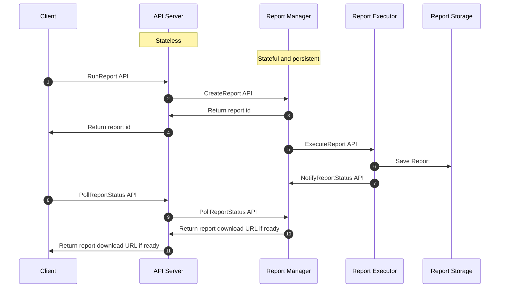

# Small Ad Manager
This project aims to build a fully functional system similar to Google Ad Manager, but one that can run on a laptop. As a result, scalability has been sacrificed.
It is built based on public information and assisted by AI technologies like ChatGPT.

Google Ad Manager Help Center: https://support.google.com/admanager/?hl=en#topic=7505988

Google Ad Manager Reporting SOAP API: https://developers.google.com/ad-manager/api/reporting#python

Report call flow

